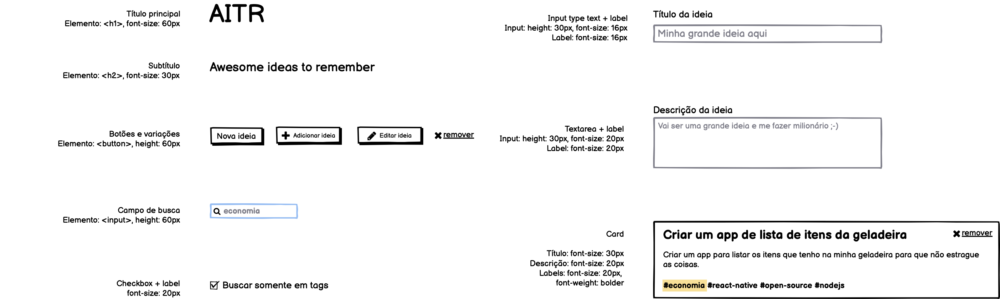
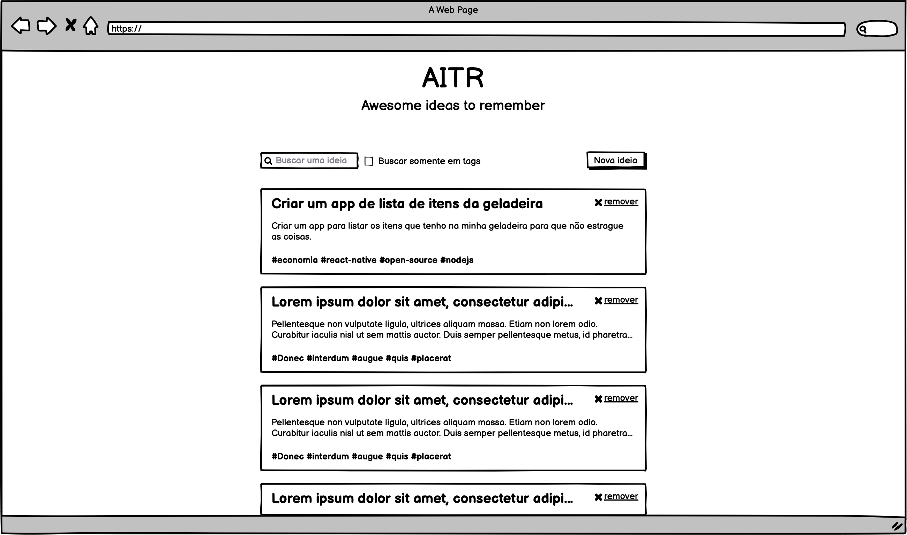
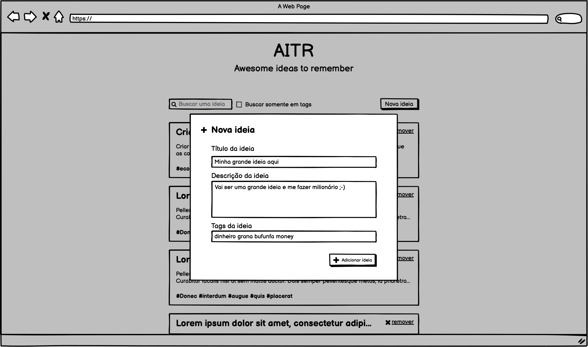
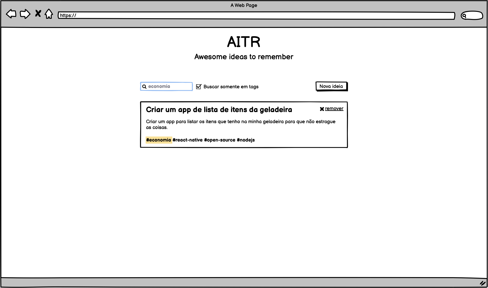
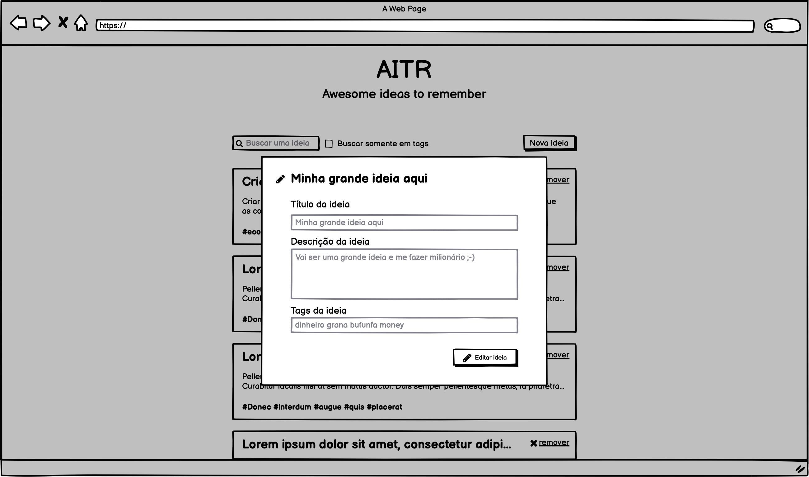
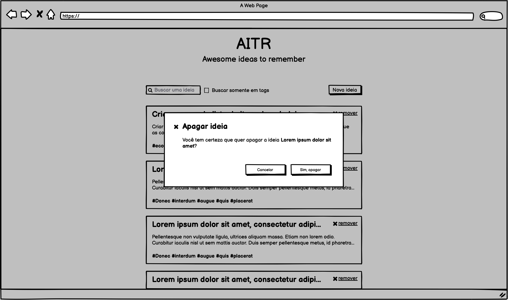

# Frontend Code Challenge

Sua tarefa é construir um front-end para a aplicação AITR (Awesome ideas to remember). A aplicação é um simples repositório de ideias com título, descrição e algumas tags.

O front-end deve ser construído utilizando qualquer framework JavaScript de sua preferência (React, Vue.js, Angular, Svelte, etc...) e seguindo os wireframes apresentados abaixo.

O teste foi separado em etapas, então, sinta-se à vontade para fazer até onde der.

> 📙 Importante ressaltar que esse teste é qualitativo e não quantitativo, vamos levar em consideração a qualidade do código e não o número de etapas concluídas.

## Componentes

Abaixo temos uma lista de elementos que são utilizados no desafio com algumas propriedades. Que tal começar pensando em criar elementos reutilizáveis?

Componentes do wireframe:

Componentes aplicando UI:

## Layout e Estrutura

Aqui fornecemos um wireframe de baixa fidelidade e um arquivo [Adobe XD com um design básico dos componentes](assets/test-fe-semantix.xd).

## User Stories Mínimos e Wireframe

Abaixo temos alguns User Stories simplificados mínimos. Considere a ordem abaixo como as etapas. Acreditamos que é melhor 1 etapa bem feita do que várias medianas ou incompletas.

1. O usuário poderá ver a lista de ideias cadastradas

2. O usuário poderá adicionar uma nova ideia

3. O usuário poderá filtrar as ideias por termos globais ou somente por tag

## User Stories Bônus

Estes User Stories não são obrigatórios, mas seria interessante discutir o desenvolvimento deles com você.

4. O usuário poderá editar uma nova ideia

5. O usuário poderá deletar uma nova ideia

## O que vamos analisar
### Itens principais
- qualidade do código
- estruturação do projeto
- quais ferramentas utilizadas e o porquê
- documentação (que tal um README.md explicando como rodar o projeto e o processo de desenvolvimento?)
- acessibilidade (dá uma olhada aqui: https://developer.mozilla.org/pt-BR/docs/Web/Accessibility/ARIA)

### Bonus:
- testes automatizados
- conteinerização da aplicação
- user stories 4 e 5

## Submissão

Envie um email para andre.ravazzi[at]semantix.com.br com o link para um repositório público do Github com a solução do desafio. No título do email coloque "{Seu nome} - Code Challenge Front-end"